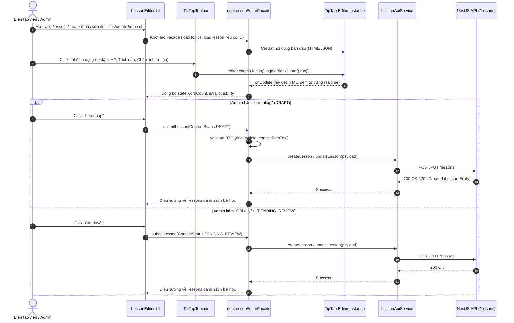

# Kế hoạch Triển khai Giai đoạn 1: Nâng cấp Trình soạn thảo bài học TipTap (Lesson Editor)

> **For Claude:** REQUIRED SUB-SKILL: Use superpowers:executing-plans to implement this plan task-by-task.

**Goal:** Thay thế trình soạn thảo thô `contentEditable` trong [LessonEditor.tsx](file:///D:/Fullit/TLCN/TLCN-DT07/frontend/src/features/lessons/components/LessonEditor.tsx) bằng hệ thống soạn thảo chuyên dụng **TipTap Editor**, tích hợp thanh công cụ định dạng tư liệu lịch sử (Tiêu đề niên đại, Hộp trích dẫn danh nhân, Ảnh tư liệu kèm chú thích, Đếm từ tự động), kiến trúc **Facade Pattern** (`LessonEditorFacade`) và bộ kiểm thử tự động.

**Architecture:** Sử dụng **Facade Pattern** (`useLessonEditorFacade`) để đóng gói toàn bộ logic phức tạp giữa TipTap Editor Instance, Rich Text State (HTML/JSON), Word Counter, Topic Metadata, và các luồng submit bài học (`DRAFT` / `PENDING_REVIEW`). Tách rời các thành phần hiển thị: `TipTapToolbar`, `TipTapContent`, và `LessonEditor`.

**Tech Stack:** Next.js 16 (App Router), React 19, TipTap (`@tiptap/react`, `@tiptap/starter-kit`, `@tiptap/extension-image`, `@tiptap/extension-link`, `@tiptap/extension-placeholder`), Tailwind CSS v4, Pytest (Automated UI Verification).

---

## 1. Sequence Diagram: Luồng Soạn thảo & Lưu trữ Bài học



---

## 2. Danh sách các Task triển khai chi tiết

### Task 1: Cài đặt Thư viện TipTap cho Frontend

**Files:**
- Modify: `frontend/package.json`

**Step 1: Cài đặt các package TipTap tương thích React 19**
Run command:
```powershell
cd D:\Fullit\TLCN\TLCN-DT07\frontend
npm install @tiptap/react @tiptap/pm @tiptap/starter-kit @tiptap/extension-image @tiptap/extension-link @tiptap/extension-placeholder
```
Expected: `package.json` bổ sung các thư viện trên và `package-lock.json` được cập nhật mà không có xung đột peer-dependencies.

**Step 2: Kiểm tra cài đặt**
Run command:
```powershell
npm list @tiptap/react
```
Expected: Trả về phiên bản TipTap đã cài đặt thành công.

**Step 3: Commit**
```bash
git add frontend/package.json frontend/package-lock.json
git commit -m "chore(frontend): install tiptap rich text editor dependencies"
```

---

### Task 2: Định nghĩa Types và Triển khai Facade Pattern (`useLessonEditorFacade`)

**Files:**
- Create: `frontend/src/features/lessons/types/editor.types.ts`
- Create: `frontend/src/features/lessons/facades/useLessonEditorFacade.ts`

**Step 1: Viết file định nghĩa kiểu dữ liệu `editor.types.ts`**
Định nghĩa contract rõ ràng cho Toolbar Action, Editor Options, và Form State:
```typescript
import { ContentStatus, DifficultyLevel } from '@/constants/enums';

export interface LessonFormData {
  title: string;
  topicId: string;
  contentRichText: string;
  difficulty: DifficultyLevel;
  sourceReferenceNote: string;
  thumbnailUrl?: string;
  status: ContentStatus;
}

export interface UseLessonEditorFacadeReturn {
  // Form State
  title: string;
  setTitle: (val: string) => void;
  selectedTopicId: string;
  setSelectedTopicId: (val: string) => void;
  contentRichText: string;
  setContentRichText: (val: string) => void;
  difficulty: DifficultyLevel;
  setDifficulty: (val: DifficultyLevel) => void;
  sourceReferenceNote: string;
  setSourceReferenceNote: (val: string) => void;
  status: ContentStatus;
  
  // Metadata & Status
  topics: Array<{ id: string; name: string }>;
  loadingLesson: boolean;
  saving: boolean;
  wordCount: number;
  lessonId: string | null;

  // Actions
  submitLesson: (nextStatus: ContentStatus) => Promise<void>;
}
```

**Step 2: Triển khai Hook `useLessonEditorFacade.ts` (Facade Pattern)**
Đóng gói toàn bộ logic tải dữ liệu bài học cũ khi edit, tải danh sách topic, tính word count, và xử lý gọi `LessonApiService`:
- Single Responsibility: `LessonEditor.tsx` chỉ lo render UI, toàn bộ logic nằm trong Facade.
- Error Handling: Thông báo lỗi người dùng rõ ràng, không nuốt ngoại lệ.

**Step 3: Kiểm tra build TypeScript**
Run command:
```powershell
cd D:\Fullit\TLCN\TLCN-DT07\frontend
npx tsc --noEmit
```
Expected: Không có lỗi TypeScript.

**Step 4: Commit**
```bash
git add frontend/src/features/lessons/types/editor.types.ts frontend/src/features/lessons/facades/useLessonEditorFacade.ts
git commit -m "feat(frontend): implement useLessonEditorFacade following facade pattern"
```

---

### Task 3: Xây dựng TipTap Components (`TipTapToolbar` & `TipTapContent`) và Styling

**Files:**
- Create: `frontend/src/features/lessons/components/TipTapToolbar.tsx`
- Create: `frontend/src/features/lessons/components/TipTapContent.tsx`
- Modify: `frontend/src/app/globals.css`

**Step 1: Tạo component `TipTapToolbar.tsx`**
Hỗ trợ đầy đủ các nút bấm định dạng văn bản lịch sử:
- Level Headings: H1, H2, H3 (dành cho tiêu đề giai đoạn / mốc lịch sử).
- Formatting: Bold, Italic, Underline, Strike.
- Lists: Bullet list (gạch đầu dòng), Ordered list (thứ tự thời gian).
- Historical Quote: Khối trích dẫn danh ngôn / chiếu thư (`editor.chain().focus().toggleBlockquote().run()`).
- Media & Links: Nút chèn ảnh tư liệu bằng URL kèm chú thích, nút chèn liên kết nguồn.
- History: Undo / Redo.

**Step 2: Tạo component `TipTapContent.tsx`**
Khởi tạo `useEditor` từ `@tiptap/react` với:
- `StarterKit`
- `Image`
- `Link`
- `Placeholder` ("Nhập nội dung bài học lịch sử chi tiết tại đây...")
- Render `<EditorContent editor={editor} />`

**Step 3: Thêm styling CSS trong `frontend/src/app/globals.css`**
Thêm class `.tiptap-editor`, `.tiptap-toolbar`, `.tiptap-content blockquote` (style giả cổ hoặc có vạch vàng/nâu lịch sử trang trọng), `.tiptap-content img` (bo góc, viền nhẹ, tự động căn giữa).

**Step 4: Kiểm tra build CSS & TypeScript**
Run command:
```powershell
cd D:\Fullit\TLCN\TLCN-DT07\frontend
npm run lint
```
Expected: 0 lint errors.

**Step 5: Commit**
```bash
git add frontend/src/features/lessons/components/TipTapToolbar.tsx frontend/src/features/lessons/components/TipTapContent.tsx frontend/src/app/globals.css
git commit -m "feat(frontend): add TipTap toolbar, content renderer and historical styling"
```

---

### Task 4: Tích hợp TipTap vào `LessonEditor.tsx`

**Files:**
- Modify: `frontend/src/features/lessons/components/LessonEditor.tsx`

**Step 1: Cập nhật `LessonEditor.tsx`**
- Thay thế hoàn toàn vùng `contentEditable` thô sơ bằng `TipTapContent` và `TipTapToolbar`.
- Kết nối `LessonEditor` với `useLessonEditorFacade()`.
- Hiển thị word count chuẩn hóa từ TipTap.
- Nút "Xem trước" (Preview) mở modal hiển thị bản render HTML của bài học.

**Step 2: Chạy thử nghiệm build Next.js**
Run command:
```powershell
cd D:\Fullit\TLCN\TLCN-DT07\frontend
npm run build
```
Expected: Build Next.js thành công 100%, không bị lỗi SSR/Hydration mismatch.

**Step 3: Commit**
```bash
git add frontend/src/features/lessons/components/LessonEditor.tsx
git commit -m "refactor(frontend): integrate TipTap rich text editor into lesson editor"
```

---

### Task 5: Automated Verification (Kiểm thử tự động với Pytest)

**Files:**
- Create: `frontend/tests/test_lesson_editor.py`

**Step 1: Viết test case tự động xác thực trình soạn thảo bài học**
Viết file `frontend/tests/test_lesson_editor.py`:
- Test 1: Kiểm tra route `/lessons/create` trả về status 200 OK.
- Test 2: Xác thực sự tồn tại của các thành phần TipTap (Toolbar, Editor Container, Placeholder).
- Test 3: Xác thực các nút định dạng cốt lõi: Tiêu đề (H1, H2), In đậm, Khối trích dẫn tư liệu, Đếm từ.
- Test 4: Xác thực các trường cấu hình bài học: Tên bài học, Chọn chủ đề, Độ khó, Nguồn tư liệu tham khảo.
- Test 5: Xác thực các nút hành động nghiệp vụ: "Lưu nháp" và "Gửi duyệt".

**Step 2: Chạy kiểm thử tự động**
Run command:
```powershell
pytest frontend/tests/test_lesson_editor.py -v
```
Expected: Tất cả các bài kiểm tra đều **PASSED**.

**Step 3: Commit & Push lên GitHub**
```bash
git add frontend/tests/test_lesson_editor.py
git commit -m "test(frontend): add automated verification suite for TipTap lesson editor"
git push origin feat/frontend
```

---

## 3. Lựa chọn thực thi (Execution Handoff)

Kế hoạch chi tiết đã hoàn tất và lưu tại `docs/plans/2026-10-04-tiptap-lesson-editor.md`.

Hai phương án thực thi:
1. **Subagent-Driven (ngay trong phiên làm việc này):** Tôi sẽ thực hiện tuần tự từng Task, chạy kiểm thử tự động và commit liên tục sau mỗi bước.
2. **Parallel Session (Phiên làm việc riêng):** Bạn có thể mở một phiên làm việc mới chuyên biệt để chạy kế hoạch này.

Bạn muốn tôi triển khai ngay theo phương án **Subagent-Driven trong phiên này** chứ?
