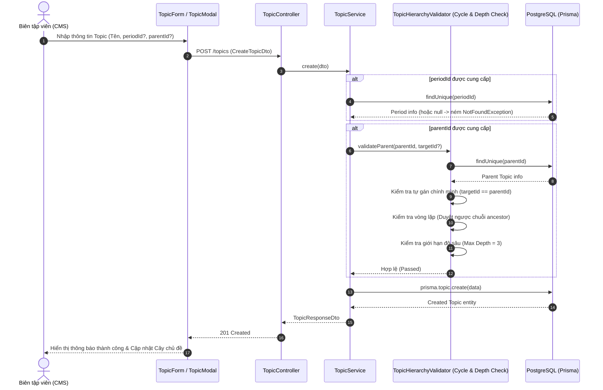
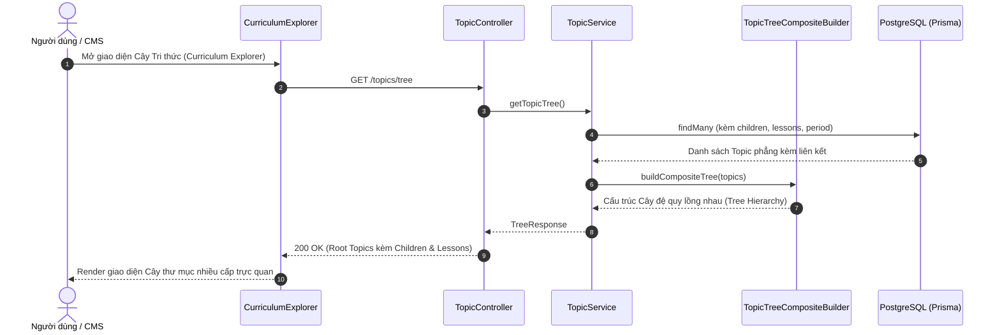

# Tài liệu Thiết kế & Quy trình Triển khai: Chuẩn hóa Mô hình Core Topic (Composite Pattern & Optional Period)

## 1. Mục tiêu kiến trúc
- **Chuẩn hóa Tầng Cốt lõi (Core Domain Model)**: Chuyển đổi mô hình `Topic` từ phẳng (Flat List) sang **Cây phân cấp tự quy chiếu (Self-referencing Tree / Composite Pattern)**.
- **Tự do hóa Giai đoạn (`Period`)**: Biến `Period` thành trường tùy chọn (100% Optional) ở cả Database, Backend API và Frontend CMS.
- **Hỗ trợ đa dạng loại hình lịch sử**: Cho phép xây dựng cây chủ đề cho Lịch sử Thế giới, Lịch sử Châu Âu, Lịch sử Chuyên đề (Quân sự, Nghệ thuật...), Thần thoại / Huyền sử mà không bị gò bó vào niên đại cố định của một quốc gia.
- **Sẵn sàng tích hợp AI (AI-ready)**: Dễ dàng để AI trích xuất và tự động gán metadata / period / timeline sau này.

---

## 2. Thiết kế Mô hình Dữ liệu (Prisma Schema)

```prisma
model Topic {
    id            String            @id @default(uuid())
    periodId      String?           @map("period_id")
    parentId      String?           @map("parent_id")
    pathType      LearningPathType  @default(CHRONOLOGICAL) @map("path_type")
    name          String            @db.VarChar(255)
    description   String?           @db.Text
    coverImageUrl String?           @map("cover_image_url") @db.VarChar(500)
    isSequential  Boolean           @default(false) @map("is_sequential")
    displayOrder  Int               @default(0) @map("display_order")
    status        ContentStatus     @default(DRAFT)
    createdAt     DateTime          @default(now()) @map("created_at")
    updatedAt     DateTime          @updatedAt @map("updated_at")

    // Relations
    period           Period?           @relation(fields: [periodId], references: [id], onDelete: Cascade)
    parent           Topic?            @relation("TopicHierarchy", fields: [parentId], references: [id], onDelete: Cascade)
    children         Topic[]           @relation("TopicHierarchy")
    lessons          Lesson[]
    historicalEvents HistoricalEvent[]

    @@index([periodId])
    @@index([parentId])
    @@index([pathType])
    @@index([status])
    @@index([displayOrder])
    @@map("topics")
}
```

---

## 3. Sequence Diagrams (Biểu đồ Tuần tự)

### 3.1. Luồng Tạo mới / Cập nhật Topic (Kiểm tra Cha - Con & Chống Chu trình)



---

### 3.2. Luồng Lấy Cây Tri thức phân cấp (Hierarchy Tree Retrieval)



---

## 4. Kế hoạch triển khai kỹ thuật (Step-by-Step)
1. **Database Schema & Migration**:
   - Chỉnh sửa `backend/prisma/schema/topic.prisma` thêm `parentId`, `parent`, `children`.
   - Chạy `npx prisma db push` hoặc `npx prisma migrate dev`.
2. **Backend**:
   - `CreateTopicDto` & `UpdateTopicDto`: Thêm `@IsOptional() @IsUUID('4') parentId?: string`.
   - `TopicHierarchyValidator` hoặc Service method: Kiểm tra chu trình lặp (Anti-Cycle) và kiểm soát độ sâu tối đa.
   - Thêm endpoint `GET /topics/tree` phục vụ render cây phân cấp.
   - Viết bài test E2E `topic.e2e-spec.ts` kiểm thử việc tạo Topic cha - con và bắt lỗi chu trình.
3. **Frontend**:
   - Cập nhật Type `TopicItem` thêm `parentId?: string`, `parent?: TopicItem`, `children?: TopicItem[]`.
   - Mở khóa `TopicForm.tsx` & `TopicModal.tsx`:
     - Gỡ bỏ validate bắt buộc `periodId`. Cho phép chọn "Không thuộc giai đoạn".
     - Thêm trường chọn "Chủ đề cha (Parent Topic)" có lọc loại trừ chính nó.
   - Cập nhật `CurriculumTree.tsx` để hỗ trợ hiển thị đệ quy các cấp Topic con.
4. **Kiểm thử tự động**:
   - Chạy test Backend & Frontend xác minh hoạt động hoàn hảo.
