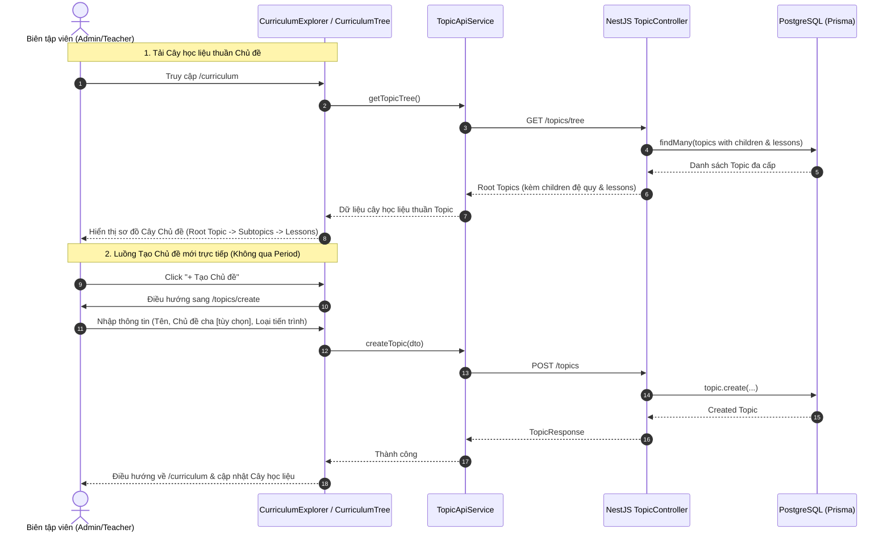

# Thiết kế Kiến trúc: Chuyển đổi mô hình Học liệu sang Thuần Chủ đề (Pure Topic-Centric Architecture)

## 1. Bối cảnh & Rationale
- **Vấn đề**: Trước đây hệ thống yêu cầu "Giai đoạn" (Period) như một tầng bắt buộc trên cùng. Điều này gây cứng nhắc, ép người dùng phải tạo Giai đoạn trước khi tạo nội dung và không phù hợp với các chuyên đề phi niên đại, lịch sử chuyên sâu hoặc liên thời kỳ.
- **Giải pháp**: Xóa bỏ hoàn toàn giao diện và luồng tạo của `Period`. Đưa `Topic` (Chủ đề) trở thành thực thể gốc duy nhất theo mô hình **Composite Pattern** (Cây tự quy chiếu):
  - **Root Topic (Chủ đề gốc)**: `parentId = null` (ví dụ: *Kháng chiến chống Mỹ, cứu nước 1954 - 1975*, *Văn minh Văn Lang - Âu Lạc*).
  - **Subtopic (Chủ đề con)**: `parentId = <topic_id>` (ví dụ: *Chiến lược Chiến tranh đặc biệt*, *Đại thắng mùa Xuân 1975*).
  - **Leaf Node (Bài học - Lesson)**: Thuộc về một Topic cụ thể.

## 2. Sequence Diagram (Biểu đồ Tuần tự)

## 3. Tuân thủ Nguyên tắc SOLID & Design Patterns
- **Single Responsibility Principle (SRP)**:
  - `TopicApiService`: Chỉ chịu trách nhiệm kết nối và xử lý dữ liệu Topic.
  - `CurriculumTree`: Chỉ chịu trách nhiệm hiển thị cấu trúc cây đa cấp (Root Topic -> Subtopic -> Lesson).
  - `NodeDetailStrategy`: Tách riêng hiển thị chi tiết theo từng loại thực thể (`TopicDetailStrategy`, `LessonDetailStrategy`).
- **Open-Closed Principle (OCP)**:
  - Cây thư mục sử dụng Composite Pattern cho phép mở rộng vô hạn cấp độ Chủ đề (Depth-level N) mà không cần sửa code render.
- **Liskov Substitution Principle (LSP)**:
  - Mọi node trong cây triển khai nhất quán qua `AnyCurriculumNode`.
- **Interface Segregation Principle (ISP)**:
  - Loại bỏ các trường thừa của `Period` khỏi giao diện tạo chủ đề.

## 4. Kế hoạch Triển khai (Step-by-step)
1. **Backend**: Hoàn thiện `GET /topics/tree` trả về đầy đủ metadata bài học (xpReward, readMinutes, summary).
2. **Frontend Model & Strategies**:
   - Cập nhật types trong `curriculum-tree.type.ts`.
   - Cập nhật `node-detail.strategy.tsx` phục vụ chi tiết Topic & Lesson.
3. **Frontend UI Components**:
   - Cập nhật `CurriculumExplorer.tsx` gọi trực tiếp `TopicApiService.getTopicTree()`, nút chính thành `+ Tạo Chủ đề`.
   - Cập nhật `CurriculumTree.tsx` render trực tiếp Root Topics -> Subtopics -> Lessons.
   - Cập nhật `TopicForm.tsx`: Loại bỏ trường chọn Giai đoạn.
   - Cập nhật `DashboardView.tsx`: Loại bỏ nút Giai đoạn, thay bằng Cây học liệu và Tạo chủ đề.
   - Cập nhật `Sidebar` / `Navigation`: Đảm bảo không còn menu Giai đoạn.
   - Redirect `/periods` về `/curriculum`.
4. **Automated Validation**:
   - Chạy kiểm thử build frontend và test backend.
