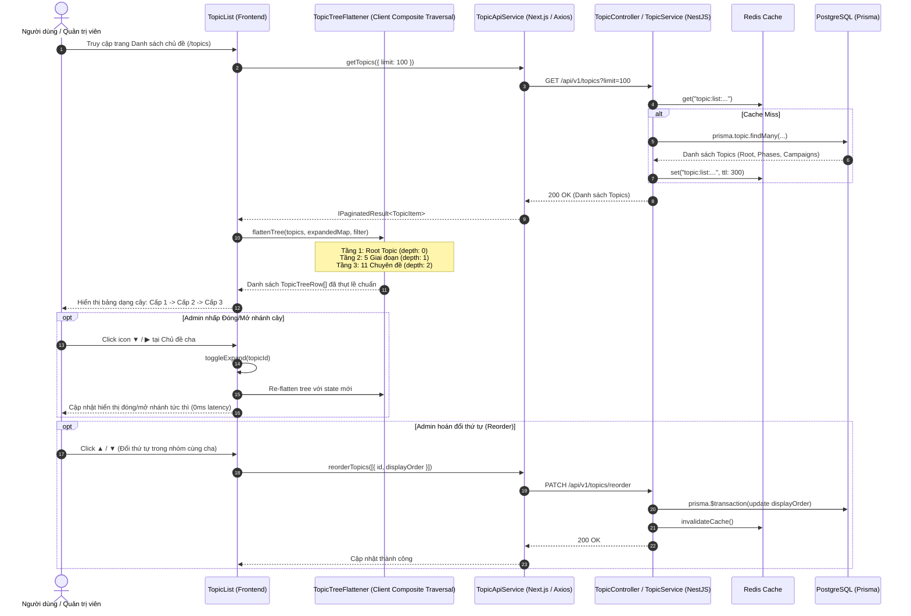

# Kế hoạch & Kiến trúc: Chuẩn hóa Cây Chủ đề Phân cấp 3 Cấp (Single Root Topic Hierarchy)

## 1. Bối cảnh & Vấn đề (Context & Problem)
- **Thực trạng**: Trước đây, 5 giai đoạn chiến lược (1954 - 1960, 1961 - 1965, 1965 - 1968, 1969 - 1973, 1973 - 1975) đều được lưu với `parentId: null` và gán thuộc tính `periodId` trỏ về Thời kỳ Kháng chiến chống Mỹ.
- **Vấn đề người dùng phản ánh**: Khi hiển thị trên bảng danh sách Chủ đề (`/topics`), cả 5 giai đoạn này đều bị gắn mác "Chủ đề gốc (Cấp 1) #01, #02... #05" và hiển thị tên thời kỳ ở cột bên cạnh, gây hiểu nhầm rằng chưa có một chủ đề cha duy nhất bao bọc và chưa phân rõ phân cấp cụ thể.
- **Mục tiêu**:
  1. **Cấp 1 (Chủ đề gốc duy nhất)**: "Kháng chiến chống Mỹ, cứu nước (1954 - 1975)" (`parentId = null`).
  2. **Cấp 2 (Giai đoạn chiến lược)**: 5 Giai đoạn lịch sử (`parentId = rootTopicWar.id`, `depth = 1`).
  3. **Cấp 3 (Chuyên đề / Chiến dịch)**: Các chiến dịch, sự kiện đòn bẩy trong từng giai đoạn (`parentId = phaseTopic.id`, `depth = 2`).
  4. Bảng danh sách `TopicList.tsx` hỗ trợ cây đa cấp (Depth 0, 1, 2) có thể đóng/mở (expand/collapse) trực quan, hiển thị rõ ràng quan hệ Cha - Con và thứ tự hiển thị nội bộ theo từng cấp.

---

## 2. Áp dụng Nguyên tắc SOLID & Design Pattern
- **Single Responsibility Principle (SRP)**:
  - `TopicTreeFlattener`: Phụ trách chuyển đổi cấu trúc cây phân cấp Composite đa tầng thành danh sách phẳng (Flat Rows) phục vụ Virtualized DataTable, kèm thông tin độ sâu (`depth`), trạng thái thu gọn/mở rộng (`isExpanded`).
  - `TopicHierarchyBadge`: Phụ trách hiển thị nhãn phân cấp tương ứng theo từng tầng (Gốc / Giai đoạn / Chuyên đề) mà không phụ thuộc vào `Period`.
- **Open/Closed Principle (OCP)**:
  - Cấu trúc cây mở rộng không giới hạn bởi các hàm đệ quy (`traverseTree`), hệ thống chỉ kiểm soát trần tối đa `MAX_DEPTH = 3` bằng Constant Guard ở Backend.
- **Composite Pattern**:
  - Mỗi `Topic` đóng vai trò là một Component trong cây: vừa có thể là Composite Node (có `children`), vừa có thể là Leaf Node (chỉ chứa `lessons`/`events`).

---

## 3. Sequence Diagram (Luồng Dữ liệu & Tương tác)

---

## 4. Kế hoạch Thực hiện Chi tiết (Execution Plan)
1. **Backend**:
   - Cập nhật `backend/prisma/seed.ts`:
     - Tạo Root Topic `b0000000-0000-4000-8000-000000000000`: "Kháng chiến chống Mỹ, cứu nước (1954 - 1975)" (`parentId: null`).
     - Gán 5 giai đoạn làm con trực tiếp của Root Topic (`parentId: rootTopicWar.id`, Cấp 2).
     - Giữ nguyên các chuyên đề/chiến dịch là con trực tiếp của các giai đoạn tương ứng (`parentId: phase.id`, Cấp 3).
     - Chạy lại `npm run seed` và kiểm tra log.
2. **Frontend**:
   - Mở rộng `TopicTreeRow` trong `TopicList.tsx` hỗ trợ `depth: number` (0: Cấp 1, 1: Cấp 2, 2: Cấp 3).
   - Tối ưu hóa hàm `displayRows` với thuật toán duyệt cây DFS đa cấp theo Composite Pattern, tôn trọng trạng thái `expandedMap`.
   - Cập nhật hiển thị cột "Chủ đề (Phân cấp Cha - Con)" với thụt đầu dòng tương ứng (`pl-0`, `pl-6`, `pl-12`).
   - Cập nhật cột "Vị trí phân cấp" để hiển thị rõ:
     - Cấp 1: "Chủ đề gốc (Cấp 1)", nút "+ Thêm giai đoạn".
     - Cấp 2: "↳ Thuộc: [Chủ đề gốc]", "Giai đoạn (Cấp 2)", nút "+ Thêm chuyên đề".
     - Cấp 3: "↳ Thuộc: [Giai đoạn]", "Chuyên đề (Cấp 3)".
     - Xóa bỏ hiển thị thừa `item.period?.name`.
   - Cập nhật cột "Thứ tự" hiển thị `Gốc #01`, `Giai đoạn #01..05`, `Chuyên đề #01..03`.
3. **Kiểm thử & Xác minh (Verification)**:
   - Chạy test backend `npm test -- src/topic`.
   - Build frontend `npm run build` không lỗi.
   - Kiểm tra UI render đúng 3 cấp phân cấp rõ ràng.
