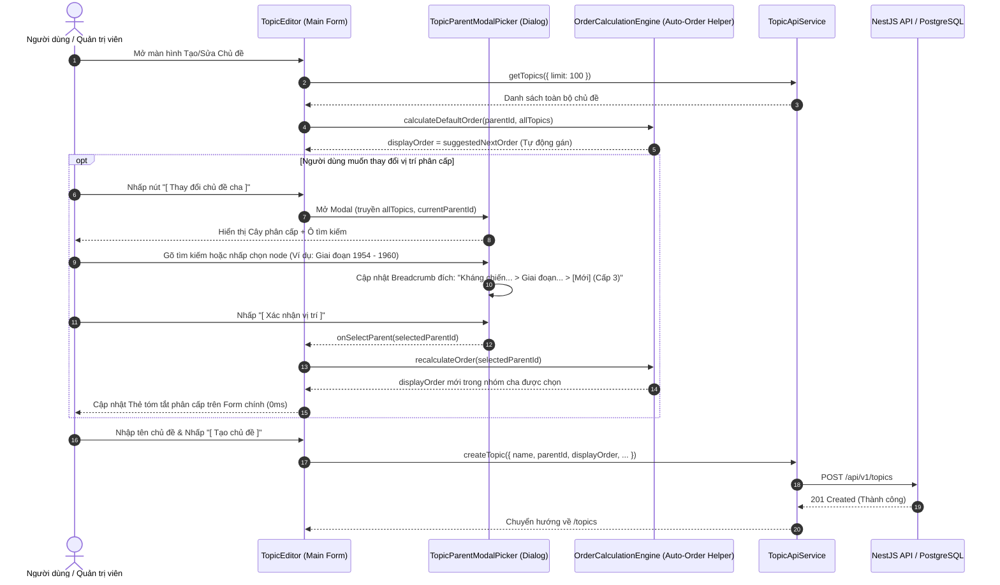

# Kế hoạch & Kiến trúc: Modal Tree Picker & Tinh Gọn Vị Trí Thứ Tự (Topic Parent Modal Picker)

## 1. Bối cảnh & Vấn đề (Context & Problem)
- **Thực trạng**:
  - Giao diện tạo/chỉnh sửa chủ đề (`TopicEditor.tsx`) trước đây có khối "02. Dòng thời gian & Vị trí thứ tự" chiếm diện tích quá lớn ở cột chính với stepper số và dải xem trước cuộn dọc.
  - Người dùng phải tự nhớ và nhập số thứ tự `#1, #2...` thủ công. Khi hệ thống có hàng chục hay hàng trăm chủ đề, điều này gây quá tải nhận thức nghiêm trọng.
  - Bộ chọn "Chủ đề cha" ở sidebar là một thẻ `<select>` phẳng, khiến danh sách bị kéo dài, không phân biệt được cấp bậc, và dễ bấm nhầm vào chủ đề Cấp 3 (gây lỗi `MAX_DEPTH_EXCEEDED` ở backend).
  - Vẫn còn sót lại trường "Giai đoạn lịch sử" không còn cần thiết sau khi chuyển sang mô hình Pure Topic.
- **Mục tiêu**:
  1. Xây dựng **Modal Chọn Chủ đề Cha (`TopicParentModalPicker.tsx`)**:
     - Hiển thị cây phân cấp đa tầng trực quan với khả năng mở/đóng từng nhánh.
     - Ô tìm kiếm nhanh theo tên chủ đề.
     - Tự động làm mờ (disabled) các chủ đề đã đạt trần tối đa (Cấp 3) để ngăn ngừa lỗi logic.
     - Breadcrumb xem trước vị trí tạo thực tế.
  2. Tinh gọn giao diện chính của `TopicEditor.tsx`:
     - Tự động hóa tính toán thứ tự hiển thị: Mặc định luôn xếp vào cuối danh sách của Cha được chọn (`maxOrder + 1`).
     - Bỏ khối Section 02 cồng kềnh, chuyển thành một tùy chọn thứ tự tinh giản.
     - Xóa bỏ triệt để trường *Giai đoạn lịch sử*.
     - Hiển thị thẻ tóm tắt phân cấp quan hệ kèm nút `[ Thay đổi chủ đề cha ]` mở Modal.

---

## 2. Thiết Kế Hướng Đối Tượng & SOLID Design Patterns
- **Single Responsibility Principle (SRP)**:
  - `TopicParentModalPicker`: Chuyên trách việc hiển thị cấu trúc cây phả hệ, tìm kiếm và chọn node cha hợp lệ.
  - `TopicEditor`: Tập trung vào quản lý form dữ liệu và gọi API tạo/sửa.
- **Open/Closed Principle (OCP) & Guard Pattern**:
  - Cấu trúc cây tính toán `depth` linh hoạt: các node có `depth >= 2` (tức Cấp 3) sẽ tự động bị đánh dấu `isSelectable = false` vì bất kỳ node con nào sinh ra từ nó sẽ có `depth = 3` (Cấp 4 > MAX_DEPTH 3).
- **Composite Pattern**:
  - Tái cấu trúc danh sách `TopicItem[]` thành cây `TopicPickerTreeNode` có `children`, hỗ trợ duyệt đệ quy và mở rộng/thu gọn tự nhiên.

---

## 3. Sequence Diagram (Luồng Chọn Vị Trí & Tự Động Tính Thứ Tự)

---

## 4. Kế hoạch Triển khai (Execution Steps)
1. **Tạo Component `TopicParentModalPicker.tsx`**:
   - Nhận props: `isOpen`, `onClose`, `onSelect`, `topics`, `selectedParentId`, `currentTopicId` (để tránh tự chọn chính mình khi sửa).
   - Search filter, expand/collapse, visual breadcrumb, disabled check cho `depth >= 2`.
2. **Cập nhật `TopicEditor.tsx`**:
   - Loại bỏ trường `periodId` và Section 02 cồng kềnh.
   - Thêm Thẻ "Phân cấp quan hệ" với nút mở Modal `TopicParentModalPicker`.
   - Thu gọn cấu hình Thứ tự thành bộ chọn thông minh: Tự động xếp cuối (mặc định) / Đầu danh sách / Nhập số.
   - Cập nhật checklist Tiêu chuẩn biên tập.
3. **Kiểm thử & Xác minh (Verification)**:
   - Build frontend `npm run build` đạt 0 lỗi.
   - Kiểm tra UI render trực quan, không còn bất kỳ sự cồng kềnh hay thuật ngữ thừa nào.
