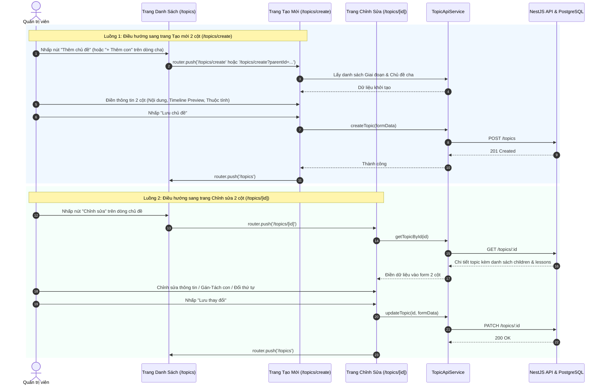

# Thiết Kế Tính Năng: Chuyển Sang Route Trang Mới và Tối Ưu Bảng Phân Cấp (Topic Editorial Route & Visual Hierarchy Table)

## 1. Sequence Diagram: Điều Hướng Route Trang Mới & Tối Ưu Giao Diện

```mermaid
sequenceDiagram
    autonumber
    actor Admin as Quản trị viên
    participant ListPage as Trang Danh Sách (/topics)
    participant CreatePage as Trang Tạo Mới (/topics/create)
    participant EditPage as Trang Chỉnh Sửa (/topics/[id])
    participant TopicApi as TopicApiService
    participant Backend as NestJS API & PostgreSQL

    %% Luồng 1: Tạo mới qua Route trang mới
    rect rgb(240, 248, 255)
    Note over Admin, CreatePage: Luồng 1: Điều hướng sang trang Tạo mới 2 cột (/topics/create)
    Admin->>ListPage: Nhấp nút "Thêm chủ đề" (hoặc "+ Thêm con" trên dòng cha)
    ListPage->>CreatePage: router.push('/topics/create' hoặc '/topics/create?parentId=...')
    CreatePage->>TopicApi: Lấy danh sách Giai đoạn & Chủ đề cha
    TopicApi-->>CreatePage: Dữ liệu khởi tạo
    Admin->>CreatePage: Điền thông tin 2 cột (Nội dung, Timeline Preview, Thuộc tính)
    Admin->>CreatePage: Nhấp "Lưu chủ đề"
    CreatePage->>TopicApi: createTopic(formData)
    TopicApi->>Backend: POST /topics
    Backend-->>TopicApi: 201 Created
    TopicApi-->>CreatePage: Thành công
    CreatePage->>ListPage: router.push('/topics')
    end

    %% Luồng 2: Chỉnh sửa qua Route trang mới
    rect rgb(245, 255, 250)
    Note over Admin, EditPage: Luồng 2: Điều hướng sang trang Chỉnh sửa 2 cột (/topics/[id])
    Admin->>ListPage: Nhấp nút "Chỉnh sửa" trên dòng chủ đề
    ListPage->>EditPage: router.push('/topics/[id]')
    EditPage->>TopicApi: getTopicById(id)
    TopicApi->>Backend: GET /topics/:id
    Backend-->>TopicApi: Chi tiết topic kèm danh sách children & lessons
    TopicApi-->>EditPage: Điền dữ liệu vào form 2 cột
    Admin->>EditPage: Chỉnh sửa thông tin / Gán-Tách con / Đổi thứ tự
    Admin->>EditPage: Nhấp "Lưu thay đổi"
    EditPage->>TopicApi: updateTopic(id, formData)
    TopicApi->>Backend: PATCH /topics/:id
    Backend-->>TopicApi: 200 OK
    EditPage->>ListPage: router.push('/topics')
    end
```
