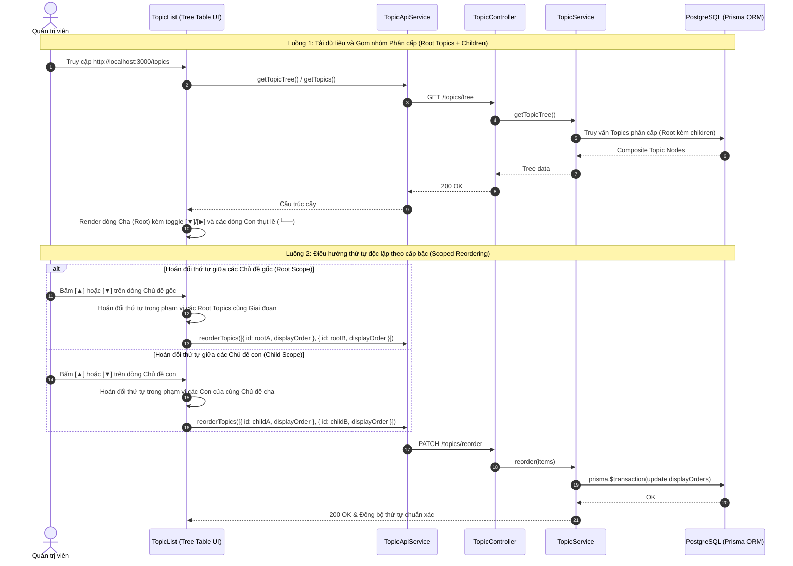

# Thiết Kế Tính Năng: Gom Nhóm Chủ Đề Cha - Con (Hierarchical Tree Table for Topics)

## 1. Sequence Diagram: Gom Nhóm Phân Cấp & Điều Hướng Thứ Tự Độc Lập

```mermaid
sequenceDiagram
    autonumber
    actor Admin as Quản trị viên
    participant UI as TopicList (Tree Table UI)
    participant Api as TopicApiService
    participant Controller as TopicController
    participant Service as TopicService
    participant DB as PostgreSQL (Prisma ORM)

    Note over Admin, DB: Luồng 1: Tải dữ liệu và Gom nhóm Phân cấp (Root Topics + Children)
    Admin->>UI: Truy cập http://localhost:3000/topics
    UI->>Api: getTopicTree() / getTopics()
    Api->>Controller: GET /topics/tree
    Controller->>Service: getTopicTree()
    Service->>DB: Truy vấn Topics phân cấp (Root kèm children)
    DB-->>Service: Composite Topic Nodes
    Service-->>Controller: Tree data
    Controller-->>Api: 200 OK
    Api-->>UI: Cấu trúc cây
    UI->>UI: Render dòng Cha (Root) kèm toggle [▼]/[▶] và các dòng Con thụt lề (└──)

    Note over Admin, DB: Luồng 2: Điều hướng thứ tự độc lập theo cấp bậc (Scoped Reordering)
    alt Hoán đổi thứ tự giữa các Chủ đề gốc (Root Scope)
        Admin->>UI: Bấm [▲] hoặc [▼] trên dòng Chủ đề gốc
        UI->>UI: Hoán đổi thứ tự trong phạm vi các Root Topics cùng Giai đoạn
        UI->>Api: reorderTopics([{ id: rootA, displayOrder }, { id: rootB, displayOrder }])
    else Hoán đổi thứ tự giữa các Chủ đề con (Child Scope)
        Admin->>UI: Bấm [▲] hoặc [▼] trên dòng Chủ đề con
        UI->>UI: Hoán đổi thứ tự trong phạm vi các Con của cùng Chủ đề cha
        UI->>Api: reorderTopics([{ id: childA, displayOrder }, { id: childB, displayOrder }])
    end
    Api->>Controller: PATCH /topics/reorder
    Controller->>Service: reorder(items)
    Service->>DB: prisma.$transaction(update displayOrders)
    DB-->>Service: OK
    Service-->>UI: 200 OK & Đồng bộ thứ tự chuẩn xác
```
