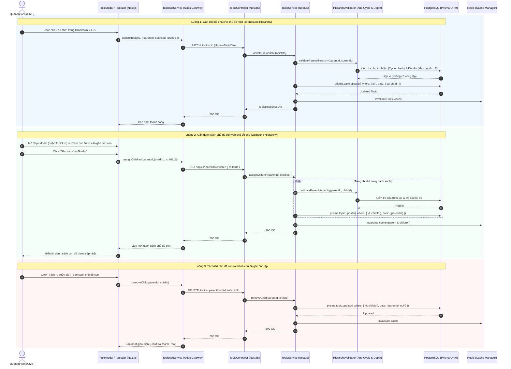

# Thiết Kế Tính Năng: Quản Lý Phân Cấp Chủ Đề Lịch Sử (Topic Hierarchy Management)

## 1. Sequence Diagram: Gắn và Quản lý Chủ đề con vào Chủ đề cha

```mermaid
sequenceDiagram
    autonumber
    actor Admin as Quản trị viên (CMS)
    participant UI as TopicModal / TopicList (Next.js)
    participant TopicApi as TopicApiService (Axios Gateway)
    participant Controller as TopicController (NestJS)
    participant Service as TopicService (NestJS)
    participant Validator as HierarchyValidator (Anti-Cycle & Depth)
    participant DB as PostgreSQL (Prisma ORM)
    participant Cache as Redis (Cache Manager)

    %% Flow 1: Chiều vào (Inbound - Gán cha khi tạo/sửa)
    rect rgb(240, 248, 255)
    Note over Admin, DB: Luồng 1: Gán chủ đề cha cho chủ đề hiện tại (Inbound Hierarchy)
    Admin->>UI: Chọn "Chủ đề cha" trong Dropdown & Lưu
    UI->>TopicApi: updateTopic(id, { parentId: selectedParentId })
    TopicApi->>Controller: PATCH /topics/:id (UpdateTopicDto)
    Controller->>Service: update(id, updateTopicDto)
    Service->>Validator: validateParentHierarchy(parentId, currentId)
    Validator->>DB: Kiểm tra chu trình lặp (Cycle check) & Độ sâu (Max depth = 3)
    DB-->>Validator: Hợp lệ (Không có vòng lặp)
    Service->>DB: prisma.topic.update({ where: { id }, data: { parentId } })
    DB-->>Service: Updated Topic
    Service->>Cache: Invalidate topic cache
    Service-->>Controller: TopicResponseDto
    Controller-->>TopicApi: 200 OK
    TopicApi-->>UI: Cập nhật thành công
    end

    %% Flow 2: Chiều ra (Outbound - Gán danh sách con vào cha)
    rect rgb(245, 255, 250)
    Note over Admin, DB: Luồng 2: Gắn danh sách chủ đề con vào chủ đề cha (Outbound Hierarchy)
    Admin->>UI: Mở TopicModal (hoặc TopicList) -> Chọn các Topic cần gắn làm con
    Admin->>UI: Click "Gắn vào chủ đề này"
    UI->>TopicApi: assignChildren(parentId, [childId1, childId2])
    TopicApi->>Controller: POST /topics/:parentId/children { childIds }
    Controller->>Service: assignChildren(parentId, childIds)
    loop Từng childId trong danh sách
        Service->>Validator: validateParentHierarchy(parentId, childId)
        Validator->>DB: Kiểm tra chu trình lặp & Độ sâu tối đa
        DB-->>Validator: Hợp lệ
        Service->>DB: prisma.topic.update({ where: { id: childId }, data: { parentId } })
    end
    Service->>Cache: Invalidate cache (parent & children)
    Service-->>Controller: 200 OK
    Controller-->>TopicApi: 200 OK
    TopicApi-->>UI: Làm mới danh sách chủ đề con
    UI-->>Admin: Hiển thị danh sách con đã được cập nhật
    end

    %% Flow 3: Gỡ bỏ chủ đề con
    rect rgb(255, 245, 245)
    Note over Admin, DB: Luồng 3: Tách/Gỡ chủ đề con ra thành chủ đề gốc độc lập
    Admin->>UI: Click "Tách ra (Hủy gắn)" bên cạnh chủ đề con
    UI->>TopicApi: removeChild(parentId, childId)
    TopicApi->>Controller: DELETE /topics/:parentId/children/:childId
    Controller->>Service: removeChild(parentId, childId)
    Service->>DB: prisma.topic.update({ where: { id: childId }, data: { parentId: null } })
    DB-->>Service: Updated
    Service->>Cache: Invalidate cache
    Service-->>Controller: 200 OK
    Controller-->>TopicApi: 200 OK
    TopicApi-->>UI: Cập nhật giao diện (Child trở thành Root)
    end
```
