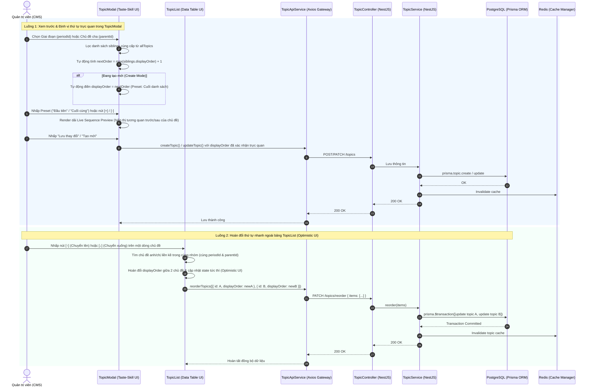

# Thiết Kế Tính Năng: Xem Trước và Sắp Xếp Thứ Tự Chủ Đề Lịch Sử (Topic Visual Order & Reordering)

## 1. Sequence Diagram: Xem Trước Thứ Tự trong Modal & Hoán Đổi Nhanh Ngoài Bảng

```mermaid
sequenceDiagram
    autonumber
    actor Admin as Quản trị viên (CMS)
    participant Modal as TopicModal (Taste-Skill UI)
    participant List as TopicList (Data Table UI)
    participant Api as TopicApiService (Axios Gateway)
    participant Controller as TopicController (NestJS)
    participant Service as TopicService (NestJS)
    participant DB as PostgreSQL (Prisma ORM)
    participant Cache as Redis (Cache Manager)

    %% Flow 1: Visual Order Placement & Live Preview trong TopicModal
    rect rgb(240, 248, 255)
    Note over Admin, Modal: Luồng 1: Xem trước & Định vị thứ tự trực quan trong TopicModal
    Admin->>Modal: Chọn Giai đoạn (periodId) hoặc Chủ đề cha (parentId)
    Modal->>Modal: Lọc danh sách siblings cùng cấp từ allTopics
    Modal->>Modal: Tự động tính nextOrder = max(siblings.displayOrder) + 1
    alt Đang tạo mới (Create Mode)
        Modal->>Modal: Tự động điền displayOrder = nextOrder (Preset: Cuối danh sách)
    end
    Admin->>Modal: Nhấp Preset ("Đầu tiên" / "Cuối cùng") hoặc nút [+] / [-]
    Modal->>Modal: Render dải Live Sequence Preview (hiển thị tương quan trước/sau của chủ đề)
    Admin->>Modal: Nhấp "Lưu thay đổi" / "Tạo mới"
    Modal->>Api: createTopic() / updateTopic() với displayOrder đã xác nhận trực quan
    Api->>Controller: POST/PATCH /topics
    Controller->>Service: Lưu thông tin
    Service->>DB: prisma.topic.create / update
    DB-->>Service: OK
    Service->>Cache: Invalidate cache
    Service-->>Controller: 200 OK
    Controller-->>Api: 200 OK
    Api-->>Modal: Lưu thành công
    end

    %% Flow 2: Quick Reorder (Hoán đổi nhanh ngoài bảng TopicList)
    rect rgb(245, 255, 250)
    Note over Admin, DB: Luồng 2: Hoán đổi thứ tự nhanh ngoài bảng TopicList (Optimistic UI)
    Admin->>List: Nhấp nút [↑] (Chuyển lên) hoặc [↓] (Chuyển xuống) trên một dòng chủ đề
    List->>List: Tìm chủ đề anh/chị liền kề trong cùng nhóm (cùng periodId & parentId)
    List->>List: Hoán đổi displayOrder giữa 2 chủ đề & cập nhật state tức thì (Optimistic UI)
    List->>Api: reorderTopics([{ id: A, displayOrder: newA }, { id: B, displayOrder: newB }])
    Api->>Controller: PATCH /topics/reorder { items: [...] }
    Controller->>Service: reorder(items)
    Service->>DB: prisma.$transaction([update topic A, update topic B])
    DB-->>Service: Transaction Committed
    Service->>Cache: Invalidate topic cache
    Service-->>Controller: 200 OK
    Controller-->>Api: 200 OK
    Api-->>List: Hoàn tất đồng bộ dữ liệu
    end
```
